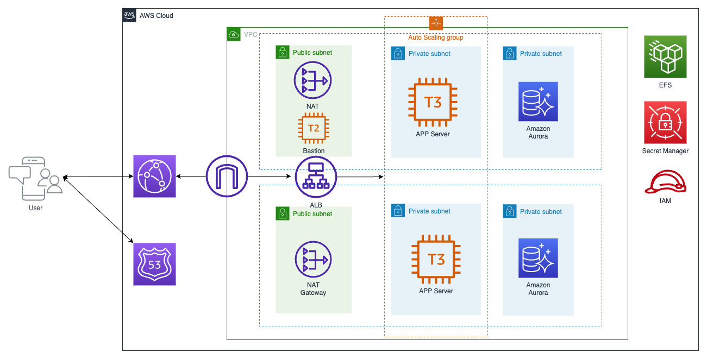

# Install Wordpress in a typical 3-Tier architecture on AWS Infra

## Instroduce
This is a project for setup the wordpress with 3 tier architecture CDKv2 typeScript.
* Auto scaling group,providing elastic scaling capabilities.
* Aurora Mysql Cluster for High Availability on persistence layer.
* EFS share the media files and PHP session.

## Architecture
See [Architecture on AWS.
](./images/3tier_web_hosting2.drawio.png)

## Commands
Use the following command to install：
* Make sure you already installed Node.
* `npm install -g aws-cdk`   install CDK
* `npm install`   install depedency library
* `cdk bootstrap`      initialize the CDK execution environment
* `cdk synth`   emits the synthesized CloudFormation template
* `cdk deploy`      deploy this stack to your default AWS account/region

